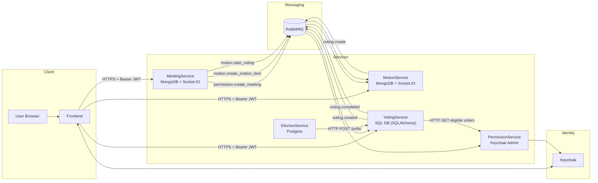
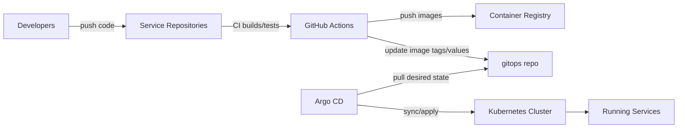
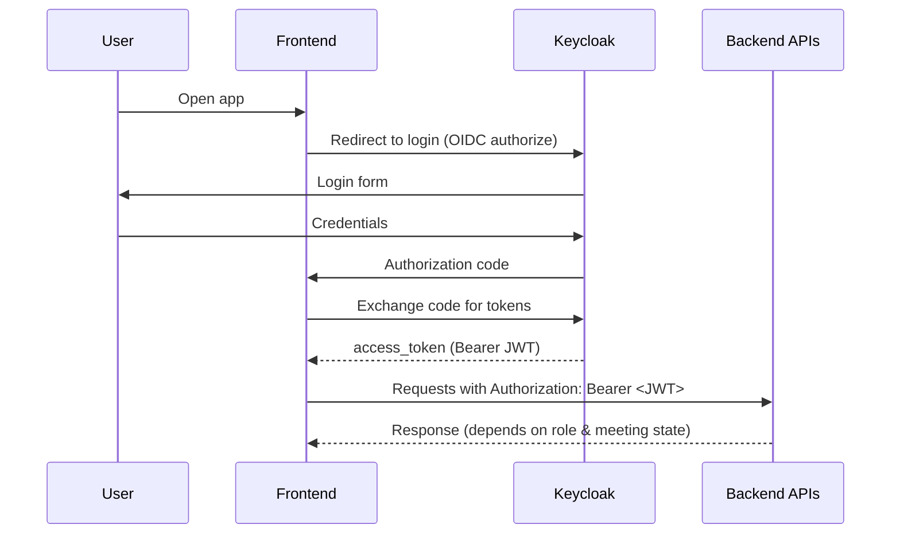
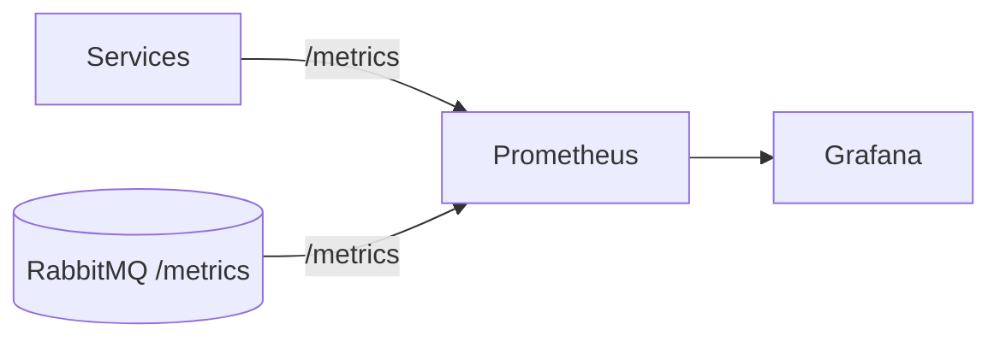
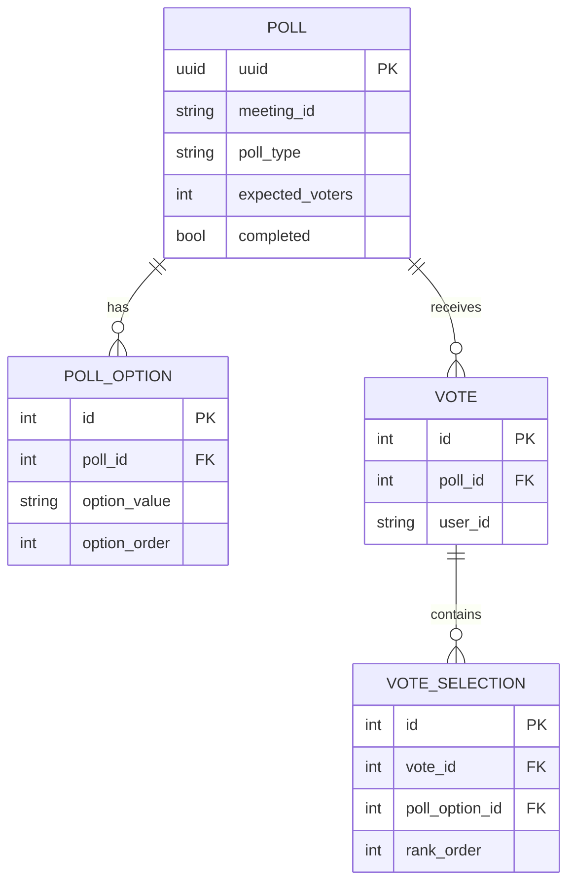
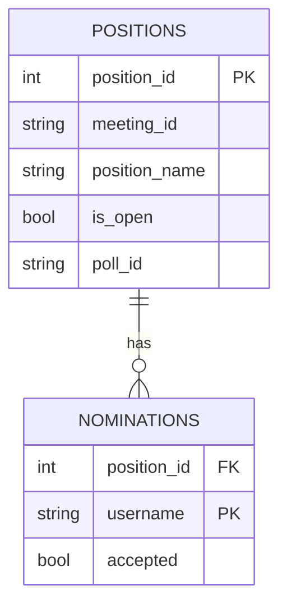
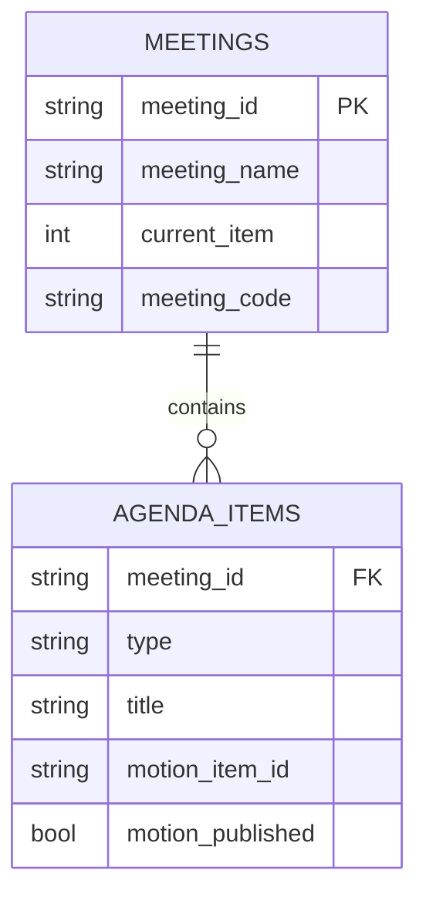
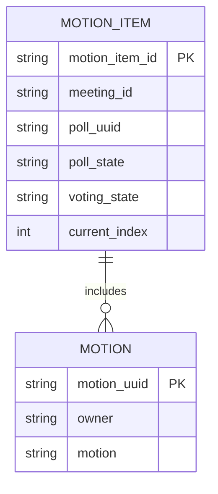

# VotingM7011E — Seminar Pre‑Submission Report (Draft)

**Last updated:** 2026-01-04 22:52  
**Status:** Initial submission for seminar (can be expanded after the seminar).

## GitHub links
- **Organization:** https://github.com/VotingM7011E
- **Repositories (microservices):** https://github.com/orgs/VotingM7011E/repositories
- **GitOps repo (Argo CD + Helm):** https://github.com/VotingM7011E/gitops

---

## 1) Motivation — Why this is a *dynamic web system*

A dynamic web system changes what it returns (data, UI state, permissions) based on **user input, stored data, and runtime state**, rather than serving static pages.

In our system:
- Users authenticate via **Keycloak (OIDC)** and receive tokens; backend APIs authorize requests based on meeting‑scoped roles (view/vote/manage).
- The system state changes over time (meeting agenda item index, nomination windows, voting in progress/completed), which changes what users can do and what is shown.
- Data is persisted in databases (MongoDB collections for meeting/motion state; SQL databases for elections and voting) and drives responses.
- The system is decomposed into multiple **microservices** communicating with both synchronous HTTP and asynchronous events (RabbitMQ), enabling evolving behavior.

---

## 2) High‑level architecture

### 2.1 Microservices and responsibilities (current code)

- **MeetingService** (Flask + MongoDB + Socket.IO)
  - Create meetings, manage agenda items, update `current_item`.
  - Publishes events:
    - `permission.create_meeting` when a meeting is created (so creator becomes manager/viewer)
    - `motion.create_motion_item` when moving to a motion agenda item
    - `motion.start_voting` when starting vote for a motion agenda item

- **PermissionService** (Flask + Keycloak Admin)
  - Meeting‑scoped roles stored as Keycloak realm roles: `z-<meeting_id>-<role>` where role ∈ {view, vote, manage}.
  - REST endpoints to read/write roles.
  - Consumes event `permission.create_meeting` to grant the meeting creator `view` + `manage`.

- **MotionService** (Flask + MongoDB + Socket.IO)
  - Stores motion items with motions and orchestrates sequential voting.
  - Consumes:
    - `motion.create_motion_item`
    - `motion.start_voting`
    - `voting.created`
    - `voting.completed`
  - Publishes:
    - `voting.create` (request VotingService to create a poll)

- **VotingService** (Flask + SQLAlchemy)
  - Stores polls, options, votes, vote selections.
  - Consumes:
    - `voting.create`
  - Publishes:
    - `voting.created` (poll created)
    - `voting.completed` (poll completed when expected voters reached)
  - Calls PermissionService to compute eligible voters (role `vote`) when needed.

- **ElectionService** (Flask + PostgreSQL)
  - Tables: `positions`, `nominations`.
  - Current implementation creates a poll by HTTP call to VotingService (planned: migrate to MQ like MotionService).

> Note: Some services are still in progress (ElectionService uses HTTP for poll creation today; the target design is fully event-driven).

### 2.2 Communication model

- **HTTP/REST:** user/client requests to services; ElectionService → VotingService poll creation currently via HTTP.
- **RabbitMQ events:** asynchronous orchestration of workflows (meeting creation → permissions; motion voting lifecycle; voting creation/completion callbacks).

### 2.3 Architecture diagram (Mermaid)

---

## 3) GitOps CI/CD (high level)

We deploy using **GitOps**:
- **Argo CD** watches Git repositories for desired Kubernetes manifests and continuously reconciles the cluster to match Git.
- Services are deployed as Helm charts with environment-specific values.

### 3.1 GitOps pipeline diagram

---

## 4) Security model (request flow)

### 4.1 Identity and tokens
- **Keycloak** acts as the OpenID Connect provider.
- Frontend uses an **Authorization Code** style login flow (redirect to Keycloak, exchange code for token).
- Backend APIs receive `Authorization: Bearer <access_token>` and enforce access based on meeting roles.

### 4.2 Meeting-scoped authorization
- PermissionService manages roles in Keycloak per meeting:
  - `z-<meeting_id>-view`
  - `z-<meeting_id>-vote`
  - `z-<meeting_id>-manage`
- Services use `check_role(user, meeting_id, action)` to gate routes.

### 4.3 Security flow diagram

### 4.4 Secret handling (GitOps)
- Kubernetes Secrets are **base64-encoded** and should be treated as sensitive.

---

## 5) Monitoring (metrics/logs/traces)

### 5.1 Metrics
- **Prometheus + Grafana** used for metrics and dashboards.
- RabbitMQ exposes Prometheus metrics via `rabbitmq_prometheus` plugin at `/metrics` (default port 15692).
- Prometheus Operator discovers targets using **ServiceMonitor** resources.

### 5.2 Logs and traces
- Logs: currently via Kubernetes pod logs; centralized aggregation planned.
- Traces: not implemented yet (future extension).

### 5.3 Monitoring diagram

---

## 6) Database schemas (graphical; draft)

> These schemas are inferred from code. Next step after seminar: export from live DBs for authoritative ERDs.

### 6.1 VotingService (SQLAlchemy)

### 6.2 ElectionService (PostgreSQL)

### 6.3 MeetingService (MongoDB; document shape)

### 6.4 MotionService (MongoDB; document shape)

### 6.5 PermissionService (Keycloak roles)

Meeting-scoped realm roles in Keycloak:
- `z-<meeting_id>-view`
- `z-<meeting_id>-vote`
- `z-<meeting_id>-manage`

---

## References (external docs)

- Argo CD (GitOps continuous delivery): https://argo-cd.readthedocs.io/
- Argo CD Application spec (Helm valueFiles, etc.): https://argo-cd.readthedocs.io/en/stable/user-guide/application-specification/
- Argo CD Secret Management guidance: https://argo-cd.readthedocs.io/en/stable/operator-manual/secret-management/
- Prometheus Operator (ServiceMonitor/PodMonitor): https://prometheus-operator.dev/docs/developer/getting-started/
- RabbitMQ Prometheus monitoring (`/metrics`): https://www.rabbitmq.com/docs/prometheus
- RabbitMQ URI spec: https://www.rabbitmq.com/docs/uri-spec
- Kubernetes DNS for Services: https://kubernetes.io/docs/concepts/services-networking/dns-pod-service/
