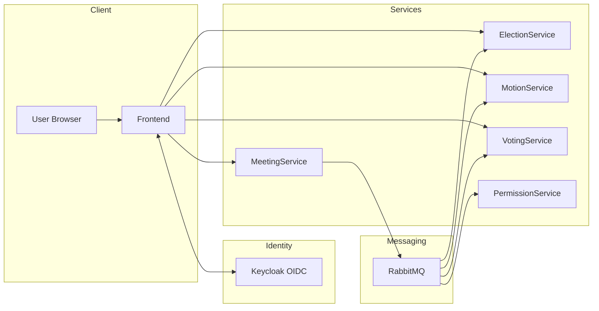
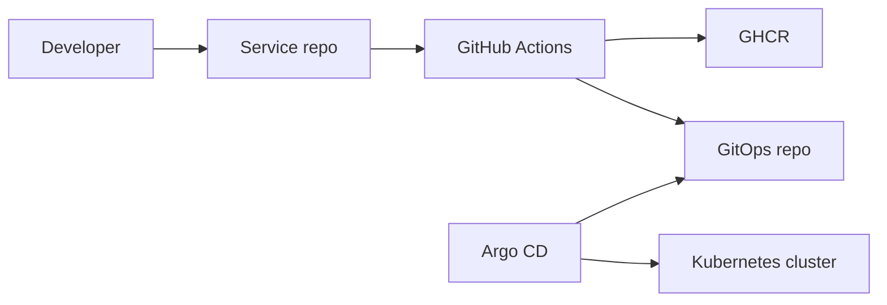
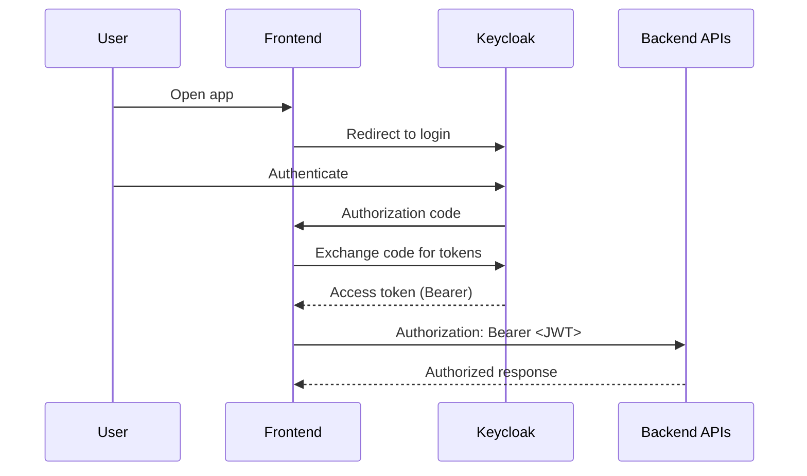
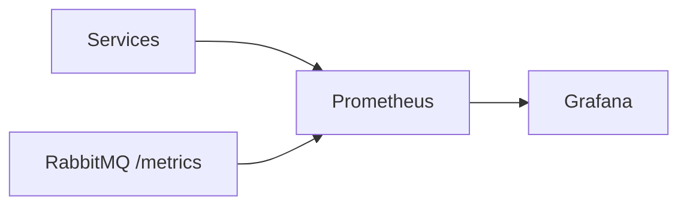
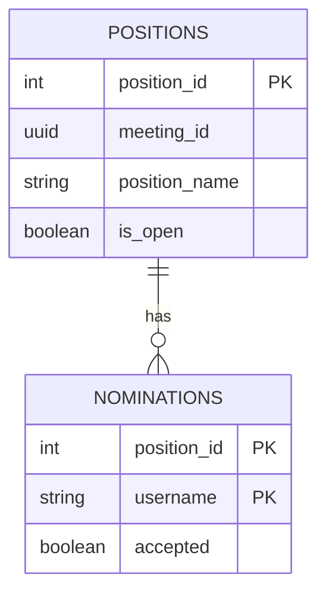

# VotingM7011E - Final Project Summary (Seminar Hand-in)

This document is a single-file summary aligned with the seminar submission checklist:
- Motivation: why the system is a dynamic web system
- High-level architecture diagrams: services + communication, GitOps CI/CD, security request flow, monitoring
- Database schemas (graphical)

---

## 1) Links (repository / organisation)

- GitHub organization: https://github.com/VotingM7011E
- Repository list (all repos): https://github.com/orgs/VotingM7011E/repositories
- GitOps repo: https://github.com/VotingM7011E/gitops

---

## 2) Motivation: why this is a dynamic web system

A dynamic web system changes content and behavior at runtime based on user input, stored data, and system state (not static pages served unchanged).[^dyn1][^dyn2]

In VotingM7011E, the system is dynamic because:

- User actions drive state transitions (meetings progress, nominations are added/accepted, positions are opened/closed, votes happen), which changes what users can do and what the UI/APIs return.
- Services persist and query domain state (for example ElectionService positions and nominations), so responses depend on current database state.
- Access is identity and permission dependent, so different users can see/do different things.

---

## 3) High-level architecture

### 3.1 Services (current repos)

From the organization repository list, the system is split into separate services and infrastructure repos:

- MeetingService
- ElectionService
- MotionService
- VotingService
- PermissionService
- Frontend
- gitops

This structure is visible in the organization repository list.[^org1]

This follows a microservices approach: independently deployable services that communicate via APIs and messaging.[^ms1][^ms2]

### 3.2 Communication (HTTP + RabbitMQ)

- HTTP/REST for synchronous calls (Frontend -> services)
- RabbitMQ for asynchronous workflow events between services

RabbitMQ supports Prometheus metrics via the built-in `rabbitmq_prometheus` plugin and exposes metrics at `/metrics` (commonly port 15692).[^rmq1][^rmq2]

#### Diagram: services and communication

GitHub renders Mermaid diagrams when Mermaid syntax is inside a fenced code block with the `mermaid` language identifier.[^gh-mermaid]

---

## 4) GitOps CI/CD (how deployments happen)

We use Argo CD for GitOps continuous delivery: desired Kubernetes state is stored in Git and Argo CD reconciles the cluster to match.[^argo1][^argo2]

A documented pattern in this organization is:

1) GitHub Actions builds a container image
2) Push image to GitHub Container Registry (GHCR)
3) Update values/manifests in the GitOps repo
4) Argo CD detects Git changes and syncs to Kubernetes

(See the CI/CD demo repos in the organization for the applied pattern.)[^org1]

#### Diagram: GitOps pipeline

---

## 5) Security model (Keycloak + JWT request flow)

We use Keycloak as an OpenID Connect (OIDC) provider.[^kc1] Applications/services validate bearer access tokens (JWTs) on each request (typical REST security model).[^kc2]

High-level request flow:

Kubernetes secrets note: Secret values are base64-encoded and stored unencrypted by default unless encryption at rest is configured.[^k8s-secrets]

Argo CD secret handling note: Argo CD documents secret-management approaches to avoid committing plaintext secrets to Git (e.g., sealed/encrypted secret workflows).[^argo-secrets]

---

## 6) Monitoring (metrics)

We use Prometheus + Grafana for metrics. With Prometheus Operator, targets can be discovered via ServiceMonitor / PodMonitor resources.[^promop]

RabbitMQ metrics are exposed via the Prometheus plugin at /metrics (commonly port 15692).[^rmq1][^rmq2]

---

## 7) Database schemas

### 7.1 ElectionService database schema (from provided project docs)

The ElectionService docs included in this submission define these tables:

- positions(position_id PK, meeting_id UUID, position_name, is_open)
- nominations(position_id FK, username, accepted) with a composite primary key (position_id, username)

Source files provided with this submission: `schema.sql` and `api.yml`.

### 7.2 ElectionService API surface (from provided OpenAPI)

The provided OpenAPI (`api.yml`) describes endpoints:

- POST /positions
- GET /positions
- POST /positions/{id}/close
- POST /positions/{id}/nominations
- GET /positions/{id}/nominations
- GET /positions/{id}/nominations/{username}
- POST /positions/{id}/nominations/{username}/accept

Implementation note to fix: `meeting_id` is declared as UUID in the create request but appears as integer in the `Position` schema in the OpenAPI; this should be made consistent with the database schema.

---

## 8) Notes on references (GitHub-friendly footnotes)

GitHub supports Markdown footnotes using the `[^id]` marker and a matching definition like `[^id]: ...` at the bottom of the file.[^gh-footnotes]

---

## References

[^org1]: VotingM7011E organization repositories list: https://github.com/orgs/VotingM7011E/repositories
[^dyn1]: Wikipedia - Dynamic web page: https://en.wikipedia.org/wiki/Dynamic_web_page
[^dyn2]: Fiveable - Dynamic web applications (term overview): https://fiveable.me/key-terms/media-literacy/dynamic-web-applications
[^ms1]: Atlassian - Microservices architecture: https://www.atlassian.com/microservices/microservices-architecture
[^ms2]: Microsoft - Microservices architecture style (Azure Architecture Center): https://learn.microsoft.com/en-us/azure/architecture/guide/architecture-styles/microservices
[^rmq1]: RabbitMQ documentation - Prometheus: https://www.rabbitmq.com/docs/prometheus
[^rmq2]: RabbitMQ Prometheus plugin README (source): https://github.com/rabbitmq/rabbitmq-server/blob/main/deps/rabbitmq_prometheus/README.md
[^gh-mermaid]: GitHub Docs - Creating diagrams (Mermaid fenced code blocks): https://docs.github.com/en/get-started/writing-on-github/working-with-advanced-formatting/creating-diagrams
[^argo1]: Argo CD documentation (overview): https://argo-cd.readthedocs.io/
[^argo2]: Argo CD Application specification: https://argo-cd.readthedocs.io/en/stable/user-guide/application-specification/
[^kc1]: Keycloak - Securing Apps / OIDC layers: https://www.keycloak.org/securing-apps/oidc-layers
[^kc2]: Keycloak Authorization Services guide (bearer token-based REST security): https://www.keycloak.org/docs/latest/authorization_services/index.html
[^k8s-secrets]: Kubernetes - Secrets good practices: https://kubernetes.io/docs/concepts/security/secrets-good-practices/
[^argo-secrets]: Argo CD - Secret management: https://argo-cd.readthedocs.io/en/stable/operator-manual/secret-management/
[^promop]: Prometheus Operator - Getting started: https://prometheus-operator.dev/docs/developer/getting-started/
[^gh-footnotes]: GitHub Changelog - Footnotes now supported in Markdown fields (syntax example): https://github.blog/changelog/2021-09-30-footnotes-now-supported-in-markdown-fields/
